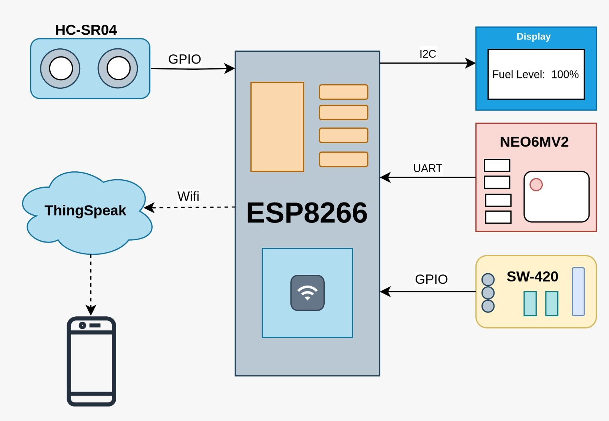

## Fuel Theft Detection
This code implements a fuel theft detection system using an ESP8266 microcontroller. It interfaces with an HC-SR04 ultrasonic sensor to measure the current fuel level in a tank and a vibration sensor to detect unusual activity. The system calculates the fuel level and displays it on an OLED screen. It continuously monitors the fuel level and triggers an interrupt service routine (ISR) if a significant drop in fuel is detected, indicating potential theft. The OLED display shows the current fuel level in centimeters.

### Fuel level measurement
The HC-SR04 ultrasonic sensor works by transmitting an ultrasonic wave and then receiving the reflected wave after it bounces off an object. The microcontroller calculates the duration between the transmission and reception of the wave. Using this time, the distance traveled by the wave is computed with the formula:

`s = vt`

Where:

- **s** is the distance traveled by the wave.
- **v** is the speed of sound.
- **t** represents the time taken for the wave to travel to the object and back.

This distance measurement can then be used for various applications, such as detecting fuel levels or detecting potential theft. As the distance travelled by the wave 's' is twice the distance required the required distance 'D = s/2'

